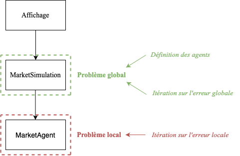

# P2P_Simulation
Algorithmes permettant la simulation d'un marché pair-à-pair de l'énergie.

La structure de ces algorithmes est donnée ci-dessous.

C'est le fichier "Affichage.jl" qui permet de lancer la simulation.
